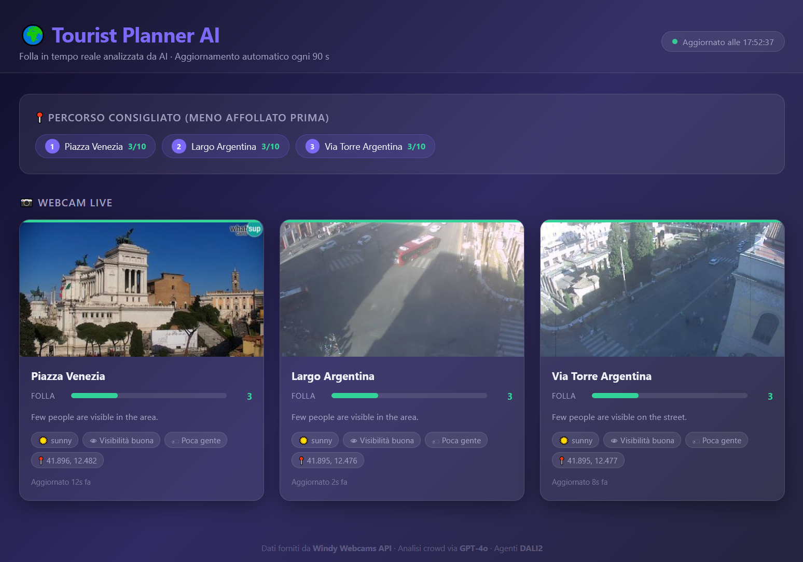

# DALI2 Webcam Tourist Planner

> Real-time crowd-aware monument visit planning using DALI2 agents, public webcams, and GPT-4o vision analysis.



## Architecture

```
┌─────────────────────────────────────────────────────────┐
│                    Windy Webcam API                     │
│         (public webcam snapshots of monuments)          │
└────────────────────────┬────────────────────────────────┘
                         │  HTTP (every 90s, rate-limited)
                         ▼
┌─────────────────────────────────────────────────────────┐
│              Python Webcam Bridge                       │
│  • Fetches preview images from Windy API                │
│  • Skips fetch if fresh image is already cached         │
│  • Sends images to GPT-4o (OpenRouter) for analysis     │
│  • Publishes crowd_report events to DALI2 via LINDA     │
│  • Caches image + analysis in Redis (TTL = 4×interval)  │
└───────────┬────────────────────────┬────────────────────┘
            │  Redis pub/sub (LINDA) │  Redis key-value cache
            ▼                        ▼
┌───────────────────────┐  ┌────────────────────────────┐
│      DALI2 Agents     │  │     Public Frontend        │
│  ┌────────┐ ┌───────┐ │  │  Flask on :9000            │
│  │planner │ │monitor│ │  │  • Crowd cards + webcam    │
│  │beliefs │ │ logs  │ │  │    snapshots (from cache)  │
│  └────────┘ └───────┘ │  │  • Optimal visit route     │
│  Web UI :8080 (admin) │  │  • Auto-refresh every 90s  │
└───────────────────────┘  └────────────────────────────┘
```

**Data flow:**
1. **Webcam Bridge** fetches live snapshots from Windy public webcams (at most once per `POLL_INTERVAL` per camera)
2. If a fresh image is already cached in Redis, the fetch + GPT-4o call is skipped entirely to respect Windy API rate limits
3. Each new image is sent to **GPT-4o** (via OpenRouter) which returns crowd level (0-10), weather, and visibility
4. Results are published as `crowd_report` events to the DALI2 **planner** agent via Redis LINDA channel
5. Image + analysis data are stored in Redis (`webcam:img:{id}`, `webcam:data:{id}`) with TTL = `POLL_INTERVAL × 4`
6. The **planner** agent maintains beliefs about each monument's crowd level and computes an optimal visit route (least crowded first)
7. A **monitor** agent logs all events and provides situational awareness
8. The **public frontend** (:9000) reads data exclusively from the Redis cache — it never calls Windy directly
9. The **admin Web UI** (:8080) shows raw agent beliefs, logs, and allows injecting events

## Quick Start (Docker)

```bash
# 1. Edit .env with your API keys
cp .env.example .env
# Set OPENROUTER_API_KEY=sk-or-...

# 2. Start all services
docker compose up --build

# 3. Open the public tourist planner
# http://localhost:9000

# 4. Open the DALI2 admin Web UI
# http://localhost:8080
```

## Configuration

All settings are in `.env`:

| Variable | Description | Default |
|----------|-------------|---------|
| `WINDY_API_KEY` | Windy webcam API key | (provided) |
| `WEBCAMS` | Comma-separated `id:name:lat:lon` | Rome webcams |
| `OPENROUTER_API_KEY` | OpenRouter API key for GPT-4o | (required) |
| `OPENROUTER_MODEL` | Vision model to use | `openai/gpt-4o` |
| `POLL_INTERVAL` | Seconds between scans (min 60) | `90` |
| `REDIS_HOST` | Redis hostname | `redis` |
| `DALI2_PORT` | Admin Web UI port | `8080` |
| `FRONTEND_PORT` | Public tourist planner port | `9000` |
| `APP_TITLE` | Title shown in the public UI | `Tourist Planner AI` |

### Adding Webcams

Add entries to the `WEBCAMS` variable in `.env`:

```
WEBCAMS=1600351836:Piazza Venezia:41.8962:12.4823,1345830065:Via Torre Argentina:41.8953:12.4766
```

Format: `webcam_id:display_name:latitude:longitude`

Find webcam IDs at [windy.com/webcams](https://www.windy.com/webcams).

## User Interaction

**Public tourist planner** (http://localhost:9000):
- View live webcam snapshots and crowd analysis for each monument
- Colour-coded crowd indicator (green → red) and weather badges
- Recommended visit order (least crowded first) computed by the DALI2 planner
- Auto-refreshes every 90 s; images served from Redis cache (Windy API never called by the frontend)

**Admin Web UI** (http://localhost:8080):
- View real-time agent logs and beliefs
- Inject `plan_visit` event to the `planner` agent to trigger route computation
- Inject `request_scan` to force an immediate webcam refresh
- View the computed plan in the planner's beliefs (`current_plan`)

**Via REST API:**
```bash
# Trigger visit planning
curl -X POST http://localhost:8080/api/send \
  -H "Content-Type: application/json" \
  -d '{"to":"planner","content":"plan_visit"}'

# Request immediate scan
curl -X POST http://localhost:8080/api/send \
  -H "Content-Type: application/json" \
  -d '{"to":"planner","content":"request_scan"}'

# View planner beliefs (crowd data + plan)
curl http://localhost:8080/api/beliefs?agent=planner
```

## Without Docker

```bash
# Terminal 1: Redis
docker run -d --name dali2-redis -p 6379:6379 redis:7-alpine

# Terminal 2: DALI2
cd ../DALI2
swipl -l src/server.pl -g main -- 8080 ../DALI2-webcam-planner/agents/webcam_planner.pl

# Terminal 3: Webcam Bridge
cd bridge
pip install -r requirements.txt
WINDY_API_KEY=... OPENROUTER_API_KEY=... WEBCAMS=... REDIS_HOST=localhost python webcam_bridge.py

# Terminal 4: Public Frontend
cd frontend
pip install -r requirements.txt
REDIS_HOST=localhost python app.py
```

## DALI2 Agents

### planner
- Receives `crowd_report` events from the bridge
- Maintains `monument/9` beliefs with real-time crowd/weather data
- Computes optimal visit routes (sorted by crowd level ascending)
- Fires high-crowd alerts when level ≥ 8
- Optionally consults AI oracle for route optimization advice

### monitor
- Logs all system events with timestamps
- Periodic status summaries
- Situational awareness dashboard

## Image Caching & API Rate Limits

The Windy Webcam API imposes strict per-webcam rate limits.  The system enforces a hard boundary at two levels:

1. **Bridge (webcam_bridge.py)** — before fetching a webcam, checks if `webcam:img:{id}` already exists in Redis.  If it does (TTL not expired), the fetch + GPT-4o analysis is skipped entirely for that camera in the current scan cycle.  The TTL is set to `POLL_INTERVAL × 4` seconds on write, so even forced `request_scan` events cannot trigger more than one API call per camera within that window.

2. **Frontend (frontend/app.py)** — the public web app reads images exclusively from `webcam:img:{id}` in Redis via `GET /api/image/<id>`.  It never calls Windy directly.  The HTTP response carries `Cache-Control: public, max-age=<POLL_INTERVAL>` so browsers also avoid redundant requests within the same analysis window.

## Agent Specification (DALI2)

Both agents are defined in a single file (`agents/webcam_planner.pl`). Below is the full specification with commentary.

### Planner Agent — Declaration & Beliefs

```prolog
:- agent(planner, [cycle(2)]).
believes(monuments([])).
believes(scan_count(0)).
```

### Planner Agent — Told Rules (Priority Queue)

Messages are prioritised so that crowd reports are processed first:

```prolog
told(_, crowd_report(_,_,_,_,_,_,_,_,_), 200) :- true.
told(_, analysis_error(_,_),              100) :- true.
told(_, plan_visit,                       150) :- true.
told(_, request_scan,                      50) :- true.
told(_, ai_advice(_),                     100) :- true.
```

### Planner Agent — Reactive Rule for Crowd Reports

Updates the belief base with one `monument/9` belief per webcam and triggers plan recomputation:

```prolog
crowd_reportE(WId, Name, Crowd, Weather, Desc, Vis, WDesc, Lat, Lon) :>
    ( believes(monument(WId, _, _, _, _, _, _, _, _))
    ->  retract_belief(monument(WId, _, _, _, _, _, _, _, _))
    ;   true
    ),
    assert_belief(monument(WId, Name, Crowd, Weather, Desc, Vis, WDesc, Lat, Lon)),
    ( believes(monuments(L)), \+ member(WId, L)
    ->  retract_belief(monuments(L)),
        assert_belief(monuments([WId | L]))
    ;   true
    ),
    believes(scan_count(N)),
    retract_belief(scan_count(N)),
    N1 is N + 1,
    assert_belief(scan_count(N1)),
    send(monitor, log_event(crowd_update, planner, [WId, Name, Crowd, Weather])),
    do(compute_plan).
```

### Planner Agent — Compute Plan Action

Collects all monument beliefs, sorts by crowd level (ascending), and asserts the resulting plan:

```prolog
compute_planA :-
    findall(
        crowd(Crowd, WId, Name, Weather, Lat, Lon),
        believes(monument(WId, Name, Crowd, Weather, _, _, _, Lat, Lon)),
        Monuments
    ),
    ( Monuments = []
    ->  log("No monument data yet. Request a scan first."),
        send(monitor, log_event(plan_failed, planner, no_data))
    ;   sort(Monuments, Sorted),
        log("=== VISIT PLAN (least crowded first): ~w ===", [Sorted]),
        ( believes(current_plan(_)) -> retract_belief(current_plan(_)) ; true ),
        assert_belief(current_plan(Sorted)),
        send(monitor, log_event(plan_computed, planner, Sorted))
    ).
```

### Planner Agent — High-Crowd Alert (Condition-Action Rule)

Edge-triggered: fires exactly once when a monument transitions to crowd level ≥ 8.

```prolog
believes(monument(WId, Name, Crowd, _, _, _, _, _, _)), Crowd >= 8 :<
    log("HIGH CROWD ALERT: ~w (~w) has crowd level ~w!", [Name, WId, Crowd]),
    send(monitor, log_event(high_crowd_alert, planner, [WId, Name, Crowd])).
```

### Planner Agent — Past-Event Memory

```prolog
past_event(crowd_report(_,_,_,_,_,_,_,_,_), 600).
remember_event(crowd_report(_,_,_,_,_,_,_,_,_), 3600).
remember_event_mod(crowd_report(_,_,_,_,_,_,_,_,_), number(50), last).
```

### Monitor Agent

Logs all events and produces periodic summaries:

```prolog
:- agent(monitor, [cycle(2)]).

log_eventE(Type, Source, Details) :>
    log("[MONITOR] ~w from ~w: ~w", [Type, Source, Details]),
    assert_belief(logged(Type, Source, Details)).

status_summaryI :>
    findall(logged(T,S,D), believes(logged(T,S,D)), Logs),
    length(Logs, N),
    log("[MONITOR] Status: ~w events logged", [N]).
internal_event(status_summary, 60, forever, true, forever).

every(30, log("[MONITOR] heartbeat")).
```

## License

Apache License 2.0
